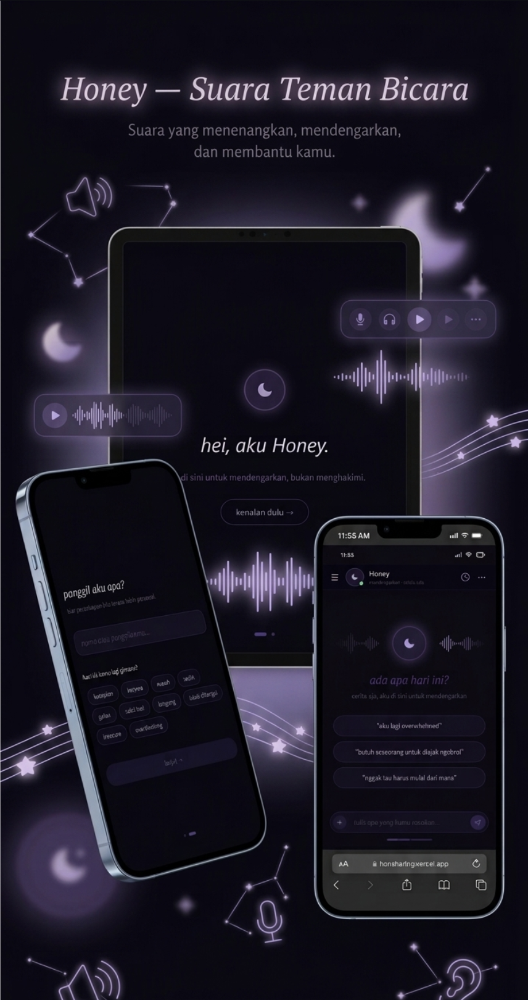

# Honey

<p align="center">
  
</p>

<p align="center">
  Honey is an AI companion designed to listen, understand, and respond with genuine empathy.  
  Built as a private and safe space, Honey focuses on emotional support rather than generic information.
</p>

---

## Overview

Honey is an AI-powered companion designed to provide emotional support through meaningful conversation. The system is built with a strong emphasis on **privacy, empathy, and contextual understanding**.

Instead of functioning as a traditional chatbot, Honey focuses on listening and validating emotions. By combining modern large language models with contextual retrieval techniques, the system can understand emotional patterns from past conversations and respond with greater sensitivity.

All conversations are stored locally and encrypted, ensuring that personal reflections remain entirely under the user’s control.

---

## Tech Stack

### Core Framework


### Styling & UI


### AI & Machine Learning


### Storage


---

## Core Features

### Empathetic Conversation

Honey is designed to listen and validate emotional experiences rather than simply providing factual responses. The interaction style prioritizes understanding, reflection, and supportive dialogue.

### Privacy-First Architecture

All conversation history is encrypted and stored locally on the user’s device. Sensitive data never leaves the client in plain text.

### Retrieval-Augmented Empathy

Honey uses a Retrieval-Augmented Generation approach to recall relevant emotional context from previous conversations. This allows the system to recognize patterns and respond with more continuity and awareness.

### Adaptive Language Mode

Users can choose between two communication styles:

* **Casual Mode** – conversational tone similar to a close friend
* **Formal Mode** – calm and reflective tone similar to a mature listener

---

## Security & Data Principles

Honey is designed with a strict privacy philosophy:

**Zero-Knowledge Storage**
Conversation history is never stored in a cloud database. All data remains on the user's device.

**Local Embedding Processing**
Semantic embeddings are generated locally to reduce data exposure.

**Secure Session Management**
Session-based access control ensures that conversation data remains private to the user.

---

## Project Motivation

Honey was initially created as a personal project to explore how AI can provide emotionally supportive interactions while maintaining strong privacy guarantees.

The goal is to experiment with a system where users can express thoughts freely without worrying about their data being collected, analyzed, or stored remotely.

---

## Troubleshooting

### Clearing the Local Database (IndexedDB)

Since Honey relies heavily on local browser storage for privacy, corrupted data or outdated cache in your browser's IndexedDB may occasionally cause runtime errors (such as `Cannot read properties of undefined`). If you encounter persistent issues, you can reset the local database.

**Method 1: Using the Browser Console (Recommended)**
1. Open Developer Tools in your browser (`F12` or `Ctrl + Shift + J` / `Cmd + Option + J`).
2. Navigate to the **Console** tab.
3. Run the following command:
   ```javascript
   indexedDB.deleteDatabase("rag_store");
   ```
4. Refresh the page. The application will automatically recreate the database.

**Method 2: Using the Application/Storage Panel**
* **Chrome / Edge / Brave:** Open Developer Tools (`F12`) > Go to the **Application** tab > Expand **IndexedDB** in the left sidebar > Select `rag_store` > Click **Delete database**.
* **Firefox:** Open Developer Tools (`F12`) > Go to the **Storage** tab > Expand **Indexed DB** > Right-click the database and select **Delete**.
